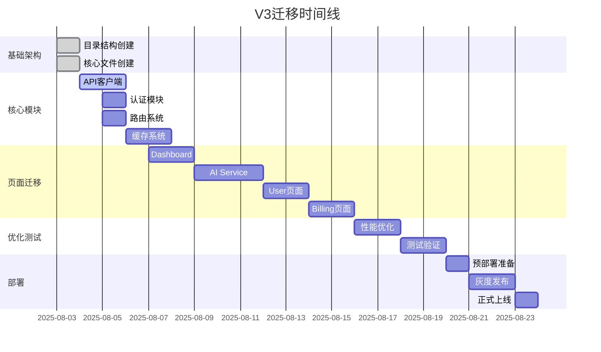

# ✅ Admin V3 迁移检查清单

> **版本**: 3.0.0  
> **创建日期**: 2025-08-03  
> **状态**: 🟢 Active  
> **目标**: 确保V3迁移过程完整、有序、可追踪

## 📊 迁移进度总览

| 模块 | 状态 | 进度 | 负责人 | 完成日期 |
|------|------|------|--------|----------|
| 🏗️ 基础架构 | ✅ 完成 | 100% | Claude | 2025-08-03 |
| 💎 核心模块 | 🔄 进行中 | 20% | Claude | - |
| 📄 页面迁移 | 📋 计划中 | 0% | Claude | - |
| 🚀 性能优化 | 📋 计划中 | 0% | Claude | - |
| 🧪 测试验证 | 📋 计划中 | 0% | Claude | - |
| 📦 部署上线 | 📋 计划中 | 0% | Claude | - |

## 🏗️ Phase 1: 基础架构 [✅ 完成]

### 目录结构创建
- [x] 创建 `/public/admin-v3/` 根目录
- [x] 创建 `/_app/` 应用核心目录
- [x] 创建 `/_api/` Vercel Functions目录
- [x] 创建 `/_core/` 核心功能目录
- [x] 创建 `/_services/` 服务层目录
- [x] 创建 `/_pages/` 页面组件目录
- [x] 创建 `/_components/` 共享组件目录
- [x] 创建 `/_utils/` 工具函数目录
- [x] 创建 `/_common/` 公共Bundle目录
- [x] 创建 `/_styles/` 样式文件目录

### 核心文件创建
- [x] `index.html` - 入口HTML
- [x] `bootstrap.js` - 启动器
- [x] `app.js` - 主应用类
- [x] `config.js` - 配置管理
- [x] `ADMIN_V3_CONTRACT.md` - 契约文档
- [x] `ADMIN_V3_IMPLEMENTATION.md` - 实施指南
- [x] `ADMIN_V3_CHECKLIST.md` - 本文档

### Vercel配置
- [ ] 创建 `vercel.json` 配置文件
- [ ] 配置路由重写规则
- [ ] 配置环境变量
- [ ] 配置边缘函数
- [ ] 配置缓存策略

## 💎 Phase 2: 核心模块 [🔄 20%]

### API客户端 (_core/api-client.js)
- [ ] 实现基础请求方法
- [ ] 添加超时控制（3秒）
- [ ] 实现重试机制
- [ ] 添加请求拦截器
- [ ] 实现响应拦截器
- [ ] 错误处理与降级
- [ ] 性能监控集成

### 认证模块 (_core/auth.js)
- [ ] 实现登录逻辑
- [ ] 实现登出逻辑
- [ ] Token管理
- [ ] 自动刷新机制
- [ ] 权限验证
- [ ] 会话管理

### 路由系统 (_core/router.js)
- [ ] 实现路由注册
- [ ] 实现路由导航
- [ ] 路由守卫
- [ ] 懒加载支持
- [ ] 路由预加载
- [ ] 历史管理
- [ ] 404处理

### 状态管理 (_core/state.js)
- [ ] 实现状态存储
- [ ] 订阅机制
- [ ] 状态持久化
- [ ] 状态同步
- [ ] 调试工具

### 缓存系统 (_core/cache.js)
- [ ] L1内存缓存
- [ ] L2 SessionStorage
- [ ] L3 IndexedDB
- [ ] L4 Vercel KV
- [ ] 缓存策略配置
- [ ] 缓存预热
- [ ] 缓存清理

### 请求去重 (_core/request-dedup.js)
- [ ] 实现去重逻辑
- [ ] 请求队列管理
- [ ] 批处理支持
- [ ] 缓存集成

## 📄 Phase 3: 页面迁移 [📋 0%]

### Dashboard页面迁移
#### 准备工作
- [ ] 分析V2 dashboard代码结构
- [ ] 识别可复用组件
- [ ] 设计模块拆分方案
- [ ] 创建迁移计划

#### 模块拆分
- [ ] 创建 `_pages/dashboard/index.js` (入口<5KB)
- [ ] 创建 `modules/stats.js` (统计模块)
- [ ] 创建 `modules/charts.js` (图表模块)
- [ ] 创建 `modules/activities.js` (活动模块)
- [ ] 创建 `modules/realtime.js` (实时更新)

#### 功能验证
- [ ] UI完全一致性检查
- [ ] 数据加载正确性
- [ ] 交互功能测试
- [ ] 性能指标测试
- [ ] 降级功能测试

### AI Service页面迁移
#### Provider配置模块
- [ ] 分析V2 provider-config.js (37KB)
- [ ] 拆分为以下模块：
  - [ ] `provider-list.js` (<10KB)
  - [ ] `provider-form.js` (<8KB)
  - [ ] `provider-api.js` (<6KB)
  - [ ] `provider-test.js` (<5KB)
  - [ ] `provider-table.js` (<4KB)
  - [ ] `provider-utils.js` (<3KB)

#### 统一配置模块
- [ ] 分析V2 unified-config.js (42KB)
- [ ] 拆分为以下模块：
  - [ ] `config-form.js` (<12KB)
  - [ ] `config-validator.js` (<8KB)
  - [ ] `config-preview.js` (<10KB)
  - [ ] `config-api.js` (<6KB)
  - [ ] `config-utils.js` (<6KB)

#### 成本分析模块
- [ ] 迁移cost-analysis.js
- [ ] 优化图表加载
- [ ] 实现数据缓存
- [ ] 添加导出功能

#### 负载均衡模块
- [ ] 迁移load-balance.js
- [ ] 优化策略选择
- [ ] 实现实时监控
- [ ] 添加健康检查

### User页面迁移
- [ ] 用户列表模块
- [ ] 用户详情模块
- [ ] 权限管理模块
- [ ] 余额管理模块
- [ ] 操作日志模块

### Billing页面迁移
- [ ] 充值模块
- [ ] 订单管理模块
- [ ] 发票管理模块
- [ ] 消费记录模块
- [ ] 统计报表模块

## 🚀 Phase 4: 性能优化 [📋 0%]

### 代码分割实施
- [ ] 识别所有>15KB文件
- [ ] 实施模块拆分
- [ ] 配置动态导入
- [ ] 测试加载性能
- [ ] 优化chunk大小

### Bundle优化
- [ ] 配置Tree Shaking
- [ ] 删除未使用代码
- [ ] 提取公共代码
- [ ] 压缩优化
- [ ] 生成分析报告

### 缓存优化
- [ ] 实现缓存预热
- [ ] 配置缓存策略
- [ ] 优化缓存键
- [ ] 监控缓存命中率
- [ ] 实现智能预测

### 网络优化
- [ ] 实现请求批处理
- [ ] 配置HTTP/2推送
- [ ] 优化API调用
- [ ] 实现预连接
- [ ] 配置CDN

### 渲染优化
- [ ] 实现虚拟滚动
- [ ] 优化重排重绘
- [ ] 实现骨架屏
- [ ] 优化动画性能
- [ ] 实现增量渲染

## 🧪 Phase 5: 测试验证 [📋 0%]

### 功能测试
- [ ] 登录/登出功能
- [ ] 路由导航功能
- [ ] 数据增删改查
- [ ] 表单验证
- [ ] 错误处理

### 性能测试
- [ ] FCP < 1.0s
- [ ] LCP < 2.0s
- [ ] FID < 50ms
- [ ] CLS < 0.05
- [ ] TTI < 3.0s
- [ ] Bundle < 200KB

### 兼容性测试
- [ ] Chrome 90+
- [ ] Firefox 88+
- [ ] Safari 14+
- [ ] Edge 90+
- [ ] 移动端适配

### 降级测试
- [ ] API失败降级
- [ ] 离线功能测试
- [ ] 缓存降级测试
- [ ] 错误恢复测试

### 安全测试
- [ ] XSS防护
- [ ] CSRF防护
- [ ] 权限验证
- [ ] Token安全
- [ ] 数据加密

## 📦 Phase 6: 部署上线 [📋 0%]

### 预部署准备
- [ ] 代码审查
- [ ] 性能审计
- [ ] 安全审计
- [ ] 文档更新
- [ ] 回滚方案

### Vercel部署
- [ ] 创建Vercel项目
- [ ] 配置环境变量
- [ ] 配置域名
- [ ] 配置SSL证书
- [ ] 配置监控

### 灰度发布
- [ ] 5%流量测试
- [ ] 监控错误率
- [ ] 收集用户反馈
- [ ] 性能监控
- [ ] 逐步扩大流量

### 正式上线
- [ ] 100%流量切换
- [ ] 监控系统稳定性
- [ ] 处理紧急问题
- [ ] 更新文档
- [ ] 通知用户

### 后续优化
- [ ] 收集性能数据
- [ ] 分析用户行为
- [ ] 持续优化
- [ ] 版本迭代
- [ ] 技术债务清理

## 📊 关键指标追踪

### 性能指标
| 指标 | V2基准 | V3目标 | 当前值 | 状态 |
|------|--------|--------|--------|------|
| FCP | ~3s | <1s | - | ⏳ |
| LCP | ~4s | <2s | - | ⏳ |
| TTI | ~5s | <3s | - | ⏳ |
| Bundle | 508KB | <200KB | - | ⏳ |
| 缓存命中率 | 0% | >80% | - | ⏳ |

### 业务指标
| 指标 | 描述 | 目标 | 当前 | 状态 |
|------|------|------|------|------|
| 页面加载成功率 | 页面正常加载比例 | >99.9% | - | ⏳ |
| API成功率 | API调用成功比例 | >99.5% | - | ⏳ |
| 错误率 | JS错误发生率 | <0.1% | - | ⏳ |
| 用户满意度 | 用户反馈评分 | >4.5/5 | - | ⏳ |

## 🚨 风险与缓解

### 技术风险
| 风险 | 影响 | 概率 | 缓解措施 |
|------|------|------|----------|
| 模块加载失败 | 高 | 中 | 实现降级机制，保留V2入口 |
| 缓存同步问题 | 中 | 低 | 多层缓存校验，版本控制 |
| 性能未达标 | 中 | 中 | 渐进式优化，持续监控 |
| 兼容性问题 | 低 | 低 | 充分测试，polyfill支持 |

### 业务风险
| 风险 | 影响 | 概率 | 缓解措施 |
|------|------|------|----------|
| 用户体验下降 | 高 | 低 | 保持UI一致，渐进迁移 |
| 数据丢失 | 高 | 低 | 完善备份，事务处理 |
| 服务中断 | 高 | 低 | 灰度发布，快速回滚 |

## 📝 每日检查项

### 开发阶段
- [ ] 代码提交前运行测试
- [ ] 检查性能指标
- [ ] 更新迁移进度
- [ ] 记录遇到的问题
- [ ] 同步团队进展

### 测试阶段
- [ ] 执行测试用例
- [ ] 记录测试结果
- [ ] 提交Bug报告
- [ ] 验证修复效果
- [ ] 更新测试文档

### 部署阶段
- [ ] 检查部署清单
- [ ] 验证环境配置
- [ ] 监控系统状态
- [ ] 收集错误日志
- [ ] 准备回滚方案

## 🎯 成功标准

### 技术成功标准
- ✅ 所有性能指标达标
- ✅ 代码覆盖率>80%
- ✅ 0 Critical Bug
- ✅ Bundle大小<200KB
- ✅ 缓存命中率>80%

### 业务成功标准
- ✅ 100%功能迁移完成
- ✅ UI 100%一致
- ✅ 用户零感知迁移
- ✅ 错误率<0.1%
- ✅ 用户满意度提升

## 📅 时间线

## 🔄 更新记录

| 日期 | 更新内容 | 更新人 |
|------|----------|--------|
| 2025-08-03 | 创建初始检查清单 | Claude |
| 2025-08-03 | 完成基础架构搭建 | Claude |
| - | - | - |

---

**清单状态**: 🟢 激活中  
**最后更新**: 2025-08-03  
**下次审查**: 2025-08-05  
**总体进度**: 15%