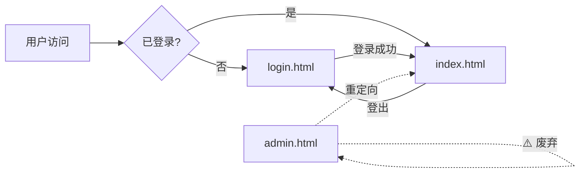

# 📄 V3 页面结构说明

> **创建日期**: 2025-08-05  
> **目的**: 明确各页面的职责，防止混淆和错误跳转  
> **状态**: 🟢 Active  

## 🎯 页面职责清单

### 核心页面

| 文件名 | 用途 | 访问权限 | 备注 |
|--------|------|----------|------|
| `index.html` | **主管理界面** | 需要登录 | V3的核心管理控制台 |
| `login.html` | 登录页面 | 公开 | 用户认证入口 |
| `admin.html` | ⚠️ 重定向页面 | - | **废弃**，仅为兼容性保留 |

### 测试页面

| 文件名 | 用途 | 访问权限 | 备注 |
|--------|------|----------|------|
| `test-login.html` | 登录测试 | 开发 | 测试认证功能 |
| `test-logout.html` | 登出测试 | 开发 | 测试登出功能 |
| `test-data-sources.html` | 数据源测试 | 开发 | 测试数据源功能 |

### 其他页面

| 文件名 | 用途 | 访问权限 | 备注 |
|--------|------|----------|------|
| `standalone.html` | 独立版本 | 公开 | 早期的独立登录页面 |
| `setup-admin.html` | 初始设置 | 首次安装 | 管理员初始化 |

## 🔀 页面跳转流程



## ⚠️ 重要提醒

### 1. 关于 admin.html
- **不要** 将其作为登录后的跳转目标
- **不要** 在新代码中引用此文件
- **计划** 在未来版本中删除此文件

### 2. 正确的跳转目标
```javascript
// ✅ 正确
redirectUrl: '/index.html'
window.location.href = './index.html';

// ❌ 错误
redirectUrl: '/admin.html'
window.location.href = './admin.html';
```

### 3. 认证检查
所有需要认证的页面都应该：
1. 导入 auth-v3.js 模块
2. 检查认证状态
3. 未认证则跳转到 login.html

## 📝 页面模板

### 需要认证的页面模板
```html
<!-- 页面用途：[具体描述] -->
<!DOCTYPE html>
<html lang="zh-CN">
<head>
    <meta charset="UTF-8">
    <title>[页面标题] - AI Product Manager V3</title>
</head>
<body>
    <script type="module">
        import authManager from './_core/auth-v3.js';
        
        // 检查认证
        const checkAuth = async () => {
            const isAuthenticated = await authManager.check();
            if (!isAuthenticated) {
                window.location.href = './login.html';
                return;
            }
            // 继续页面初始化
        };
        
        checkAuth();
    </script>
</body>
</html>
```

## 🔧 维护建议

1. **定期审查**：每月检查是否有冗余页面
2. **文档更新**：新增页面时必须更新此文档
3. **命名规范**：使用描述性的文件名，避免通用名称
4. **注释说明**：每个HTML文件顶部添加用途注释

## 📅 计划改进

### 短期（1个月内）
- [ ] 在所有HTML文件顶部添加用途注释
- [ ] 创建自动化测试验证跳转逻辑
- [ ] 更新README.md中的页面说明

### 中期（3个月内）
- [ ] 删除 admin.html 文件
- [ ] 统一页面命名规范
- [ ] 实现页面访问日志

### 长期（6个月内）
- [ ] 迁移到单页应用架构
- [ ] 实现更智能的路由系统
- [ ] 添加页面性能监控

---

**记住**：清晰的页面结构是良好用户体验的基础！