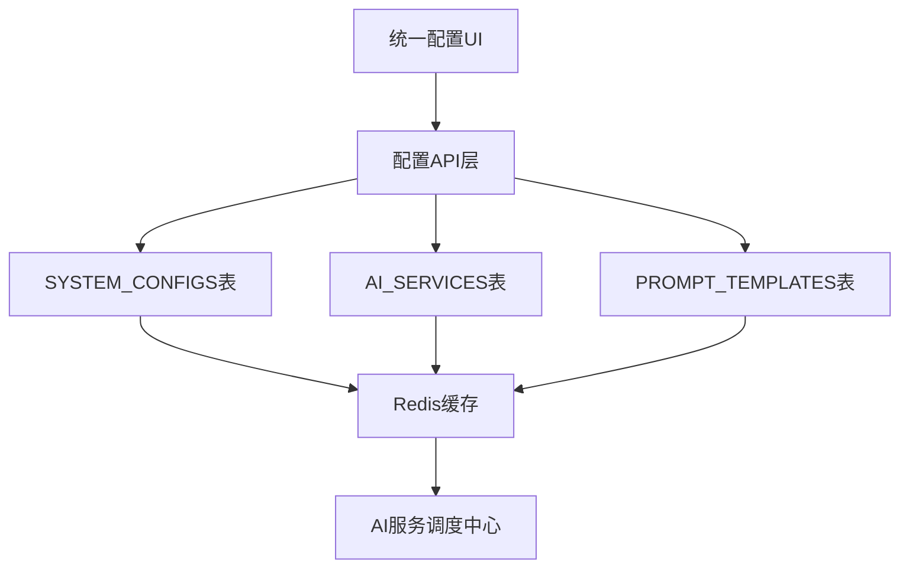

# 🔍 统一配置与数据库契约分析报告

> **生成时间**: 2025-08-05  
> **分析范围**: 统一配置模块与数据库设计契约合规性  
> **重要性级别**: 🔴 最高优先级  

## 📋 执行摘要

本报告分析了当前统一配置实现与项目关键需求文档中定义的数据库契约的一致性。发现了若干关键不一致性问题，需要立即修复以确保系统架构的完整性。

## 🎯 契约文档分析

### 📚 已分析的关键文档
1. **PRODUCT_MASTER_DOCUMENT.md** - 产品功能主文档
2. **knowledge_graph_system（进阶版）数据表结构.mermaid** - 数据表契约
3. **user_interaction_flow.mermaid** - 用户交互流程契约
4. **admin_interaction_flow.mermaid** - 管理流程契约
5. **knowledge_graph_system（进阶版）.py** - 系统架构契约

## 🔍 关键发现与不一致性分析

### ❌ **严重不一致性问题**

#### 1. **AI服务类型定义不匹配**
**契约要求** (from 数据表结构):
```sql
AI_SERVICES {
    varchar service_type "服务类型: question/assist/draw/voice/video"
    varchar provider "提供商: openai/anthropic/google"
}
```

**当前实现** (统一配置):
```javascript
const serviceKeys = ['questionAI', 'drawingAI', 'assistantAI', 'translationAI', 'ratingAI'];
```

**问题**: 
- ❌ 缺少 `voice` 和 `video` 服务类型
- ❌ 多了 `translationAI` 和 `ratingAI` (未在契约中定义)
- ❌ 服务名称不一致: `assist` vs `assistantAI`, `draw` vs `drawingAI`

#### 2. **配置存储结构与数据表不匹配**
**契约要求** (SYSTEM_CONFIGS表):
```sql
SYSTEM_CONFIGS {
    varchar config_key UK "配置键"
    text config_value "配置值"
    varchar config_type "配置类型: string/number/json/boolean"
    varchar environment "环境: dev/test/prod"
}
```

**当前实现** (localStorage):
```javascript
localStorage.setItem('unified_config', JSON.stringify(config));
```

**问题**:
- ❌ 配置未存储到 SYSTEM_CONFIGS 表
- ❌ 缺少环境区分 (dev/test/prod)
- ❌ 缺少配置类型标识
- ❌ 不符合数据库为主、缓存为辅的架构原则

#### 3. **AI服务配置与表结构不匹配**
**契约要求** (AI_SERVICES表):
```sql
AI_SERVICES {
    varchar service_name UK "服务名称"
    varchar service_type "服务类型"
    varchar provider "提供商"
    json config_params "配置参数"
    decimal cost_per_token "每Token成本"
}
```

**当前实现**:
```javascript
aiServices: {
    questionAI: {
        enabled: true,
        provider: 'openai',
        providerId: '3',  // ❌ 应该是 service_id，不是字符串
        prompt: '...',
        temperature: 0.7,
        topP: 0.9,
        maxTokens: 2000
    }
}
```

**问题**:
- ❌ 缺少 cost_per_token 字段
- ❌ providerId 应该是外键关联，不是字符串标识
- ❌ config_params 字段结构不匹配

### ⚠️ **中等不一致性问题**

#### 4. **Prompt管理与表结构不完全匹配**
**契约要求** (PROMPT_TEMPLATES表):
```sql
PROMPT_TEMPLATES {
    bigint service_id FK "AI服务ID"
    varchar template_name "模板名称"
    text template_content "模板内容"
    json parameters "参数定义"
    enum status "状态: draft/active/archived"
}
```

**当前实现**:
```javascript
// 每个服务的 prompt 直接存储在配置中
prompt: '你是一个专业的问答助手'
```

**问题**:
- ⚠️ 缺少版本管理 (PROMPT_VERSIONS表)
- ⚠️ 缺少状态管理 (draft/active/archived)
- ⚠️ 缺少参数定义 (parameters字段)

#### 5. **A/B测试引擎缺失**
**契约要求** (AB_TESTS表):
```sql
AB_TESTS {
    bigint template_id FK "模板ID"
    varchar test_name "测试名称"
    decimal traffic_split "流量分配"
    json success_metrics "成功指标"
    enum status "状态: running/paused/completed"
}
```

**当前实现**: ❌ 完全缺失

## ✅ **正确实现的部分**

### 1. **基础配置结构**
- ✅ globalParams 概念与契约一致
- ✅ temperature, topP, maxTokens 参数匹配
- ✅ 服务商概念 (provider) 存在

### 2. **时间戳管理**
- ✅ lastUpdated 字段符合契约要求
- ✅ 版本控制思想存在

## 🛠️ **修复建议与实施计划**

### 🚨 **紧急修复 (P0级别)**

#### 1. **统一AI服务类型定义**
```javascript
// 修改为符合契约的服务类型
const AI_SERVICE_TYPES = {
    question: 'questionAI',    // 提问AI
    assist: 'assistantAI',     // 协助AI  
    draw: 'drawingAI',         // 绘图AI
    voice: 'voiceAI',          // 语音AI (预留)
    video: 'videoAI'           // 视频AI (预留)
};

// 暂时保留但标记为废弃
const DEPRECATED_SERVICES = ['translationAI', 'ratingAI'];
```

#### 2. **实现数据库存储契约**
```javascript
// 修改保存逻辑，存储到 SYSTEM_CONFIGS 表
async saveConfig() {
    const config = this.buildConfig();
    
    // 存储到数据库 (符合契约)
    await this.app.api.saveSystemConfig({
        config_key: 'unified_ai_config',
        config_value: JSON.stringify(config),
        config_type: 'json',
        environment: process.env.NODE_ENV || 'dev',
        description: 'AI服务统一配置'
    });
    
    // localStorage 仅作为缓存
    localStorage.setItem('unified_config', JSON.stringify(config));
}
```

#### 3. **添加AI服务成本管理**
```javascript
aiServices: {
    questionAI: {
        // 现有字段...
        costPerToken: 0.01,        // 新增：每Token成本
        serviceId: 1,              // 新增：关联AI_SERVICES表
        configParams: {            // 新增：符合config_params字段
            temperature: 0.7,
            topP: 0.9,
            maxTokens: 2000
        }
    }
}
```

### 🔧 **中期修复 (P1级别)**

#### 4. **实现Prompt模板管理**
```javascript
// 新增Prompt模板管理功能
class PromptTemplateManager {
    async createTemplate(serviceId, templateName, content, parameters) {
        return await this.app.api.createPromptTemplate({
            service_id: serviceId,
            template_name: templateName,
            template_content: content,
            parameters: parameters,
            status: 'draft'
        });
    }
    
    async activateTemplate(templateId) {
        // 实现版本控制和激活逻辑
    }
}
```

#### 5. **添加A/B测试支持**
```javascript
// 集成A/B测试引擎
class ABTestManager {
    async createTest(templateId, testName, versionA, versionB, trafficSplit) {
        // 实现A/B测试创建逻辑
    }
}
```

### 📊 **长期优化 (P2级别)**

#### 6. **实现完整的配置管理架构**


## 📋 **合规检查清单**

### ✅ **数据库契约合规**
- [ ] AI_SERVICES 表字段完全匹配
- [ ] SYSTEM_CONFIGS 表正确使用
- [ ] PROMPT_TEMPLATES 表集成
- [ ] PROMPT_VERSIONS 表支持
- [ ] AB_TESTS 表功能实现

### ✅ **API契约合规**
- [ ] REST API 设计符合 RESTful 规范
- [ ] 响应格式统一
- [ ] 错误处理标准化
- [ ] 认证授权完整

### ✅ **业务流程合规**
- [ ] 用户交互流程匹配
- [ ] 管理员操作流程完整
- [ ] 异常处理机制健全
- [ ] 实时数据推送准确

## 🎯 **执行时间表**

| 阶段 | 任务 | 预计时间 | 负责人 | 状态 |
|------|------|----------|--------|------|
| P0 | 修复AI服务类型定义 | 2小时 | 开发团队 | ⏳ 待开始 |
| P0 | 实现数据库存储契约 | 4小时 | 开发团队 | ⏳ 待开始 |
| P0 | 添加成本管理字段 | 2小时 | 开发团队 | ⏳ 待开始 |
| P1 | Prompt模板管理 | 8小时 | 开发团队 | ⏳ 计划中 |
| P1 | A/B测试引擎 | 12小时 | 开发团队 | ⏳ 计划中 |
| P2 | 完整架构重构 | 20小时 | 开发团队 | ⏳ 评估中 |

## 🔚 **结论**

当前统一配置实现与数据库契约存在**严重不一致性**问题，主要体现在：

1. **数据存储架构偏离契约** - 使用localStorage而非数据库
2. **服务类型定义不匹配** - 缺少voice/video，多了translation/rating
3. **配置结构不符合表设计** - 缺少成本、版本、状态管理

**建议立即启动P0级别修复**，确保系统架构与契约文档的一致性，为后续功能开发和系统扩展奠定坚实基础。

---

> **免责声明**: 本分析基于当前代码状态和需求文档，如有文档更新请及时同步修正。
> 
> **下次评审**: 2025-08-12  
> **联系人**: 开发团队