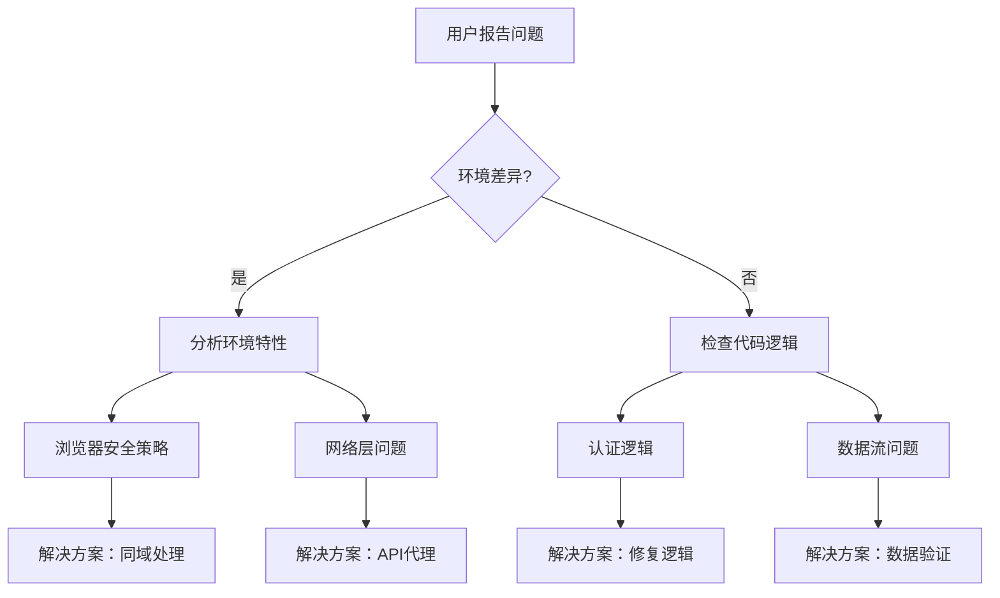

# 📚 V3重建深度分析与开发规范

> **文档版本**: 1.0.0  
> **创建日期**: 2025-08-05  
> **作者**: Claude & David Wang  
> **状态**: 🟢 生效中  

## 🔍 一、事件回顾与深度分析

### 1.1 问题起源
在之前的开发过程中，V3系统遭遇了严重的架构混乱：
- 原本独立的V3架构被错误地改造成了前后端分离
- 认证系统被改为依赖Railway后端的代理模式
- 文件结构混乱，出现大量重复和冗余代码
- 失去了V3的核心优势：独立、快速、简洁

### 1.2 问题根因分析

#### 🔴 核心问题：架构理解偏差
1. **误解了"独立"的含义**
   - ❌ 错误理解：独立 = 前后端分离
   - ✅ 正确理解：独立 = 不依赖Railway系统

2. **过度工程化**
   - ❌ 错误做法：为了"完善"而增加复杂度
   - ✅ 正确做法：保持简洁，够用即可

3. **忽视契约精神**
   - ❌ 错误做法：随意修改架构
   - ✅ 正确做法：严格遵循CONTRACT.md

### 1.3 重建过程分析

#### 第一阶段：问题诊断
- 发现无痕浏览器无法登录
- 初期误判为Railway后端问题
- 花费大量时间修复"伪问题"

#### 第二阶段：根因发现
- 用户提醒："为什么要访问Railway？"
- 发现前端直接跨域调用Railway API
- 意识到架构已经偏离设计

#### 第三阶段：架构重建
- 实现独立的Edge Function认证
- 移除所有Railway依赖
- 恢复V3的简洁架构

## 🎯 二、核心经验总结

### 2.1 架构设计原则

#### ✅ V3架构核心特征
```
V3独立架构 = {
  前端: 静态HTML/JS/CSS
  后端: Vercel Edge Functions
  数据: 本地配置/Vercel KV
  认证: 独立JWT系统
  依赖: 零外部依赖
}
```

#### ❌ 常见架构误区
```
错误模式 = {
  依赖Railway后端
  前后端分离部署
  复杂的API代理
  跨域请求
  过度抽象
}
```

### 2.2 问题解决方法论

#### 🔍 正确的问题诊断流程


#### 🎯 关键信号识别
| 信号 | 含义 | 行动 |
|------|------|------|
| "无痕浏览器不能用" | CORS/Cookie问题 | 检查跨域请求 |
| "正常浏览器可以" | 环境差异 | 分析安全策略 |
| "401错误" | 可能是网络层 | 不要只看应用层 |
| "为什么访问X？" | 架构问题 | 重新审视设计 |

### 2.3 调试技巧总结

#### 1. 多层次调试
```javascript
// Edge Function调试
console.log('🔍 Environment check:', {
  hasEnvVar: !!process.env.VAR_NAME,
  actualValue: VALUE,
  // 不输出敏感信息
});

// API响应调试
return new Response(JSON.stringify({
  success: false,
  message: 'Error message',
  debug: {  // 生产环境记得移除
    received: input,
    expected: expectedFormat,
    timestamp: new Date().toISOString()
  }
}));
```

#### 2. 渐进式修复
- 先添加调试信息，确认问题
- 实施最小改动，验证效果
- 逐步完善，避免过度修改

## 📋 三、V3开发规范

### 3.1 架构规范

#### 🏗️ 目录结构规范
```
/ai-pm-admin-v3-standalone/
├── 📁 _core/          # 核心模块（认证、路由、状态）
├── 📁 _pages/         # 页面模块（按功能分组）
├── 📁 _styles/        # 样式文件（模块化CSS）
├── 📁 api/            # Edge Functions
│   └── auth/          # 认证相关API
├── 📄 *.html          # 页面文件（不超过5个）
└── 📄 vercel.json     # 部署配置
```

#### 🔒 文件命名规范
- 核心模块：`_`开头表示内部模块
- API文件：RESTful风格，功能明确
- 页面文件：简洁明了，如`login.html`、`admin.html`

### 3.2 认证系统规范

#### 🔐 JWT认证流程
```javascript
// 1. 登录：生成Token
const token = await new SignJWT(payload)
  .setProtectedHeader({ alg: 'HS256' })
  .setIssuer('ai-pm-v3')
  .setAudience('admin-panel')
  .setExpirationTime('2h')
  .sign(JWT_SECRET);

// 2. 验证：校验Token
const { payload } = await jwtVerify(token, JWT_SECRET, {
  issuer: 'ai-pm-v3',
  audience: 'admin-panel'
});

// 3. 登出：清理本地
localStorage.removeItem('admin_token_v3');
```

#### 🔑 凭据管理规范
```javascript
// 支持多种凭据来源，优先级递减
const CREDENTIALS = [
  { source: 'environment', ...fromEnv() },
  { source: 'default', ...defaults },
  { source: 'test', ...testCreds }
];
```

### 3.3 Edge Function规范

#### ✅ 标准模板
```javascript
export const config = {
  runtime: 'edge',
};

export default async function handler(request) {
  // 1. CORS处理
  if (request.method === 'OPTIONS') {
    return new Response(null, { 
      status: 200,
      headers: CORS_HEADERS 
    });
  }

  // 2. 方法验证
  if (request.method !== 'POST') {
    return new Response(
      JSON.stringify({ 
        success: false, 
        message: 'Method not allowed' 
      }),
      { status: 405, headers: RESPONSE_HEADERS }
    );
  }

  try {
    // 3. 业务逻辑
    const body = await request.json();
    // ... 处理逻辑

    // 4. 成功响应
    return new Response(
      JSON.stringify({ success: true, data: result }),
      { status: 200, headers: RESPONSE_HEADERS }
    );

  } catch (error) {
    // 5. 错误处理
    console.error('Error:', error);
    return new Response(
      JSON.stringify({ 
        success: false, 
        message: 'Internal server error' 
      }),
      { status: 500, headers: RESPONSE_HEADERS }
    );
  }
}
```

### 3.4 前端开发规范

#### 📦 模块化原则
```javascript
// 使用ES6模块，按需加载
const { default: authManager } = await import('./_core/auth-v3.js');

// 单例模式，避免重复初始化
export default new AuthManager();
```

#### 🎨 UI交互规范
- 所有异步操作显示loading状态
- 错误信息友好且明确
- 操作反馈及时（成功/失败）
- 支持键盘快捷键（Enter提交等）

### 3.5 部署规范

#### 🚀 部署检查清单
- [ ] 移除所有调试代码
- [ ] 确认环境变量配置
- [ ] 测试所有关键路径
- [ ] 验证CORS配置
- [ ] 检查错误处理

#### 📝 版本管理
```bash
# 功能开发
git commit -m "feat: 添加新功能"

# Bug修复
git commit -m "fix: 修复认证问题"

# 文档更新
git commit -m "docs: 更新开发规范"
```

## 🚨 四、常见问题与解决方案

### 4.1 认证问题

| 问题 | 原因 | 解决方案 |
|------|------|----------|
| 401错误 | 凭据不匹配 | 检查环境变量，添加调试日志 |
| 无痕浏览器失败 | CORS限制 | 使用同域API，避免跨域 |
| Token过期 | 时间设置 | 实现自动刷新机制 |

### 4.2 部署问题

| 问题 | 原因 | 解决方案 |
|------|------|----------|
| 部署失败 | 依赖缺失 | 添加package.json |
| 环境变量无效 | 配置错误 | 使用Vercel CLI设置 |
| Edge Function错误 | 语法问题 | 使用Edge Runtime API |

## 🎯 五、核心原则总结

### 🌟 V3开发黄金法则

1. **简洁至上**：能用10行代码解决的，不写100行
2. **独立自主**：不依赖外部系统，自给自足
3. **契约精神**：严格遵循设计文档，不随意改动
4. **用户优先**：快速响应，良好体验
5. **持续改进**：记录问题，总结经验

### 📌 永远记住

> "**问题的解决方案往往在问题之外**"
> 
> 当陷入技术细节时，退一步看全局。用户的一句话可能比你的100次调试更有价值。

### 🔄 持续改进循环

```
发现问题 → 分析根因 → 实施方案 → 验证效果 → 总结经验 → 更新规范
```

## 📚 六、参考资源

### 内部文档
- `ADMIN_V3_CONTRACT.md` - 架构契约
- `ADMIN_V3_IMPLEMENTATION.md` - 实施指南
- `TROUBLESHOOTING_INCOGNITO_LOGIN.md` - 问题分析案例

### 技术栈
- Vercel Edge Functions - 无服务器函数
- Jose - JWT处理库
- ES6 Modules - 模块化开发

### 最佳实践
- JWT认证最佳实践
- CORS处理指南
- Edge Runtime限制

---

## 🏁 结语

V3的重建过程是一次宝贵的经验。它告诉我们：

1. **架构设计要清晰明确**，避免过度解释
2. **保持简洁**是一种美德，不是缺陷
3. **倾听用户**，他们的视角往往更准确
4. **记录和总结**，让错误成为财富

让我们以此为鉴，构建更好的系统！

---

**文档状态**: 🟢 生效中  
**最后更新**: 2025-08-05  
**下次审查**: 2025-09-05